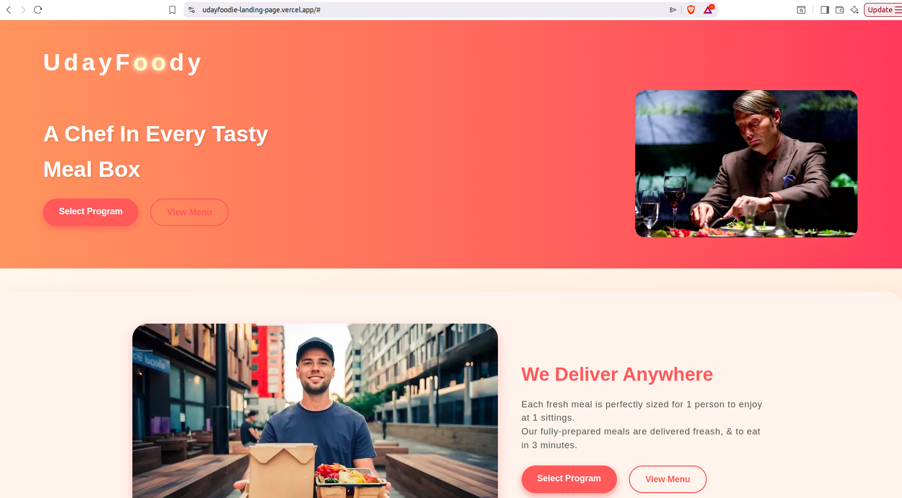

# 🍔 UdayFoodie Landing Page

A responsive food landing page built using **HTML5** and **CSS3**. This project demonstrates modern web design principles, semantic HTML structure, responsive layouts, and clean CSS styling.

---

## 📖 Project Overview

The **UdayFoodie Landing Page** is a static website created to showcase front-end development skills. It provides a visually appealing homepage for a fictional food business with sections designed to improve user engagement and browsing experience.

This repository also serves as a **Technical Writing portfolio project**, featuring structured documentation following the Docs-as-Code approach.

---

## ✨ Features

- Responsive landing page
- Modern and clean UI
- Semantic HTML5
- Organized CSS
- Optimized image assets
- Beginner-friendly project structure

---

## 🛠️ Tech Stack

| Technology | Purpose |
|------------|---------|
| HTML5 | Page Structure |
| CSS3 | Styling and Layout |

---

## 📂 Project Structure

```text
udayfoodie-landing-page/
├── assets/
│   └── Images/
├── docs/
│   ├── assets.md
│   ├── changelog.md
│   ├── contributing.md
│   ├── design.md
│   ├── faq.md
│   ├── features.md
│   ├── folder-structure.md
│   ├── getting-started.md
│   ├── glossary.md
│   ├── installation.md
│   ├── project-overview.md
│   └── troubleshooting.md
├── images/
├── index.html
├── style.css
└── README.md
```

---

## 📚 Documentation

Detailed project documentation is available in the `docs/` directory.

- Getting Started
- Installation Guide
- Project Overview
- Folder Structure
- Features
- Design
- Assets
- Troubleshooting
- FAQ
- Glossary
- Contributing Guide
- Changelog

---

## 🚀 Getting Started

Clone the repository

```bash
git clone https://github.com/Udaykalse/udayfoodie-landing-page.git
```

Open the project

```bash
cd udayfoodie-landing-page
```

Run locally by opening `index.html` in your browser.

---

## 👨‍💻 Author

**Uday Kalse**

GitHub: https://github.com/Udaykalse


## 📸 Preview



