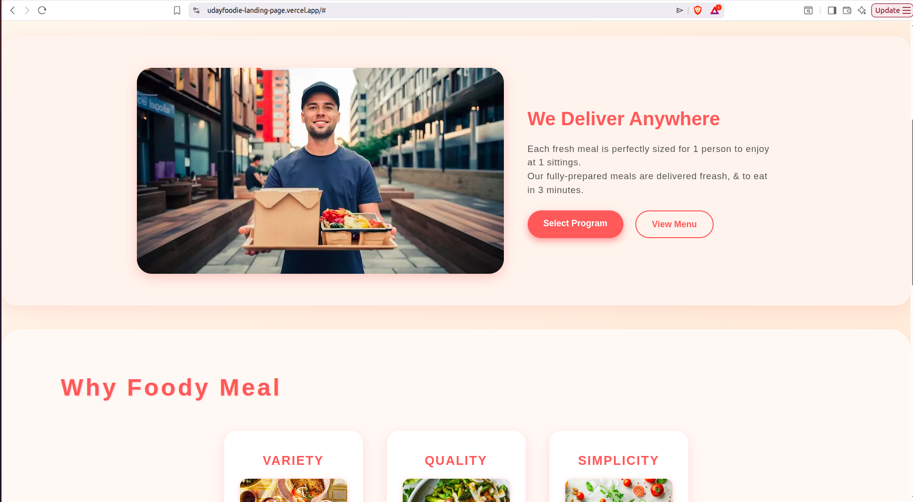
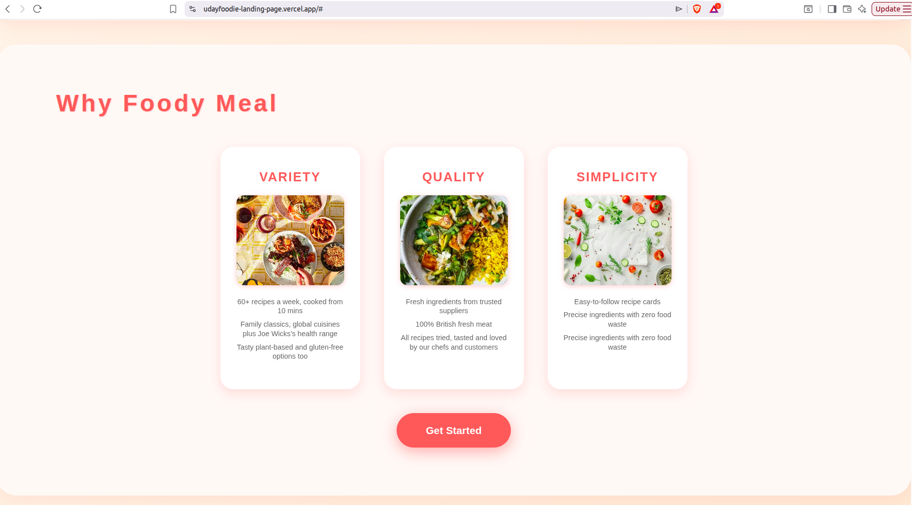
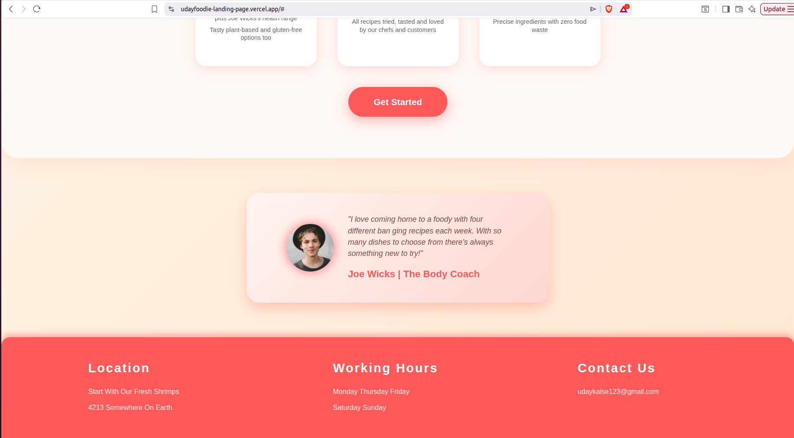

# 🍔 UdayFoodie Landing Page

> A responsive food landing page built using **HTML5** and **CSS3**.

---

## 📸 Project Preview


---

# 📖 Table of Contents

- Project Overview
- Features
- Tech Stack
- Project Structure
- Screenshots
- Documentation
- Getting Started
- Future Improvements
- Author

---

# 🚀 Project Overview

The **UdayFoodie Landing Page** is a responsive front-end web application developed using semantic HTML5 and modern CSS3.

This repository also demonstrates professional **Docs-as-Code** practices through structured technical documentation.

---

# ✨ Features

- Responsive Layout
- Hero Section
- About Section
- Menu Section
- Customer Feedback
- Modern UI
- Optimized Images
- Organized Documentation

---

# 🛠 Tech Stack

| Technology | Purpose |
|------------|----------|
| HTML5 | Structure |
| CSS3 | Styling |
| Git | Version Control |
| GitHub | Repository Hosting |
| Markdown | Documentation |

---

# 📂 Project Structure

```text
udayfoodie-landing-page/
├── assets/
├── docs/
├── images/
├── index.html
├── style.css
└── README.md
```

---

# 🖼 Screenshots

## Home


---

## About



---

## Menu



---

## Customer Feedback



---


## 📚 Documentation

- [Project Overview](docs/project-overview.md)
- [Installation Guide](docs/installation.md)
- [Getting Started](docs/getting-started.md)
- [Folder Structure](docs/folder-structure.md)
- [Features](docs/features.md)
- [Design](docs/design.md)
- [Assets](docs/assets.md)
- [Troubleshooting](docs/troubleshooting.md)
- [FAQ](docs/faq.md)
- [Glossary](docs/glossary.md)
- [Contributing](docs/contributing.md)
- [Changelog](docs/changelog.md)

---

# 🚀 Getting Started

```bash
git clone https://github.com/Udaykalse/udayfoodie-landing-page.git

cd udayfoodie-landing-page
```

Open:

```
index.html
```

---

# 🔮 Future Improvements

- JavaScript Interactivity
- Dark Mode
- Contact Form
- Backend Integration
- Shopping Cart
- Food Ordering System
- Accessibility Improvements

---

# 👨‍💻 Author

**Uday Kalse**

GitHub

https://github.com/Udaykalse